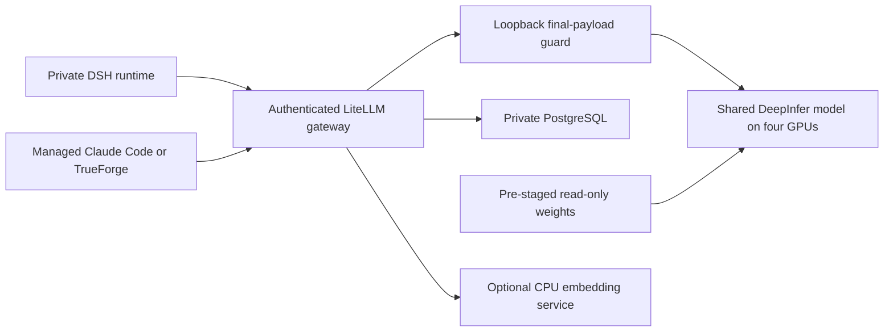

# Retained GPU inference topology

Historical reference; current GPU runtime acceptance is separate.

```mermaid

flowchart LR

 U[Private DSH runtime] --> L[Authenticated LiteLLM gateway]

 C[Managed Claude Code or TrueForge] --> L

 L --> F[Loopback final-payload guard]

 F --> S[Shared DeepInfer model on four GPUs]

 L --> D[Private PostgreSQL]

 W[Pre-staged read-only weights] --> S

 L --> O[Optional CPU embedding service]

```
